# Blue-Green Deployment on AWS

A hands-on project demonstrating zero-downtime application deployment using the Blue-Green strategy on AWS. This is the same deployment approach used by companies like Amazon, Netflix, and Swiggy to release new features without affecting live users.

---

## Project Details

- **Author:** Pooja Nerkar
- **Region:** Asia Pacific (Mumbai) — ap-south-1
- **Services Used:** EC2, Application Load Balancer, Auto Scaling Group, Launch Templates, Target Groups
- **Deployment Time:** 2 seconds
- **Rollback Time:** Under 10 seconds
- **Downtime:** Zero

---

## The Problem This Solves

Traditional deployments require stopping servers, updating code, and restarting — which means the application is down for 30 to 45 minutes. If the new version has a bug, rolling back takes another 30 minutes.

Blue-Green deployment solves this by running two identical environments simultaneously. The new version is deployed and tested on the Green environment while Blue continues serving live traffic. When Green is ready, traffic is switched in 2 seconds. If anything breaks, traffic switches back to Blue in under 10 seconds.

---

## Architecture

```
                          INTERNET
                              |
                              |
               +--------------+--------------+
               |   Application Load Balancer  |
               |         (myapp-alb)          |
               |  ap-south-1.elb.amazonaws.com|
               +--------------+--------------+
                              |
               +--------------+--------------+
               |     Weighted Routing         |
               |   (controls traffic split)   |
               +--------------+--------------+
                    |                    |
         +----------+----+    +----------+----+
         |  Blue Target  |    |  Green Target |
         |   Group       |    |   Group       |
         |  (blue-tg)    |    |  (green-tg)   |
         +----------+----+    +----------+----+
                    |                    |
         +----------+----+    +----------+----+
         |  Blue Auto    |    |  Green Auto   |
         |  Scaling Group|    |  Scaling Group|
         |  (blue-asg)   |    |  (green-asg)  |
         |               |    |               |
         |  EC2 - 1b     |    |  EC2 - 1b     |
         |  Version 1.0  |    |  Version 2.0  |
         |               |    |               |
         |  EC2 - 1c     |    |  EC2 - 1c     |
         |  Version 1.0  |    |  Version 2.0  |
         +---------------+    +---------------+
```

Both environments span multiple Availability Zones (ap-south-1b and ap-south-1c) so the application survives a data center failure automatically.

---

## Repository Structure

```
blue-green-deployment-aws/
|
|-- README.md
|
|-- blue/
|   |-- user-data.sh          (Blue server startup script - Version 1.0)
|
|-- green/
|   |-- user-data.sh          (Green server startup script - Version 2.0)
|
|-- docs/
    |-- screenshots/
        |-- 01_Blue_Launch_Template_created.png
        |-- 02_Blue_TG_created.png
        |-- 03_Blue_ASG.png
        |-- 04_Blue_ASG_running_with_2_healthy_instances.png
        |-- 05_ALB_active_pointing_to_Blue.png
        |-- 06_Blue_website_live_in_browser.png
        |-- 07_green-launch-template.png
        |-- 08_Green_TG_created.png
        |-- 09_Green_ASG_running_with_2_healthy_instances.png
        |-- 10_Green_website_verified_directly.png
        |-- 11_Green_now_live_through_ALB.png 
        |-- 12_50-50_split.png
        |-- 13_0_Blue_100_Green.png 
        |-- 14_80_Blue_20_Green.png
        
```

---

## How I Built This

### Phase 1 — Blue Environment (Version 1.0)

The Blue environment is the live production environment serving real traffic.

**Step 1 — Launch Template**

A Launch Template stores the configuration for creating new EC2 instances — the OS, instance type, security rules, and startup script. The Auto Scaling Group uses this template to create identical servers automatically.

Created `blue-launch-template` with Ubuntu 22.04, t3.micro, and a User Data script that installs Nginx and deploys the Version 1.0 webpage on first boot without any manual SSH.

Screenshot: 
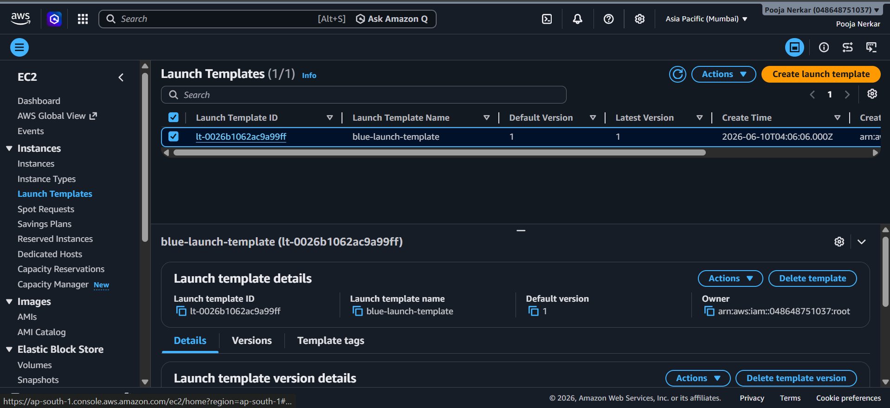

---

**Step 2 — Target Group**

A Target Group is the list of servers the Load Balancer sends traffic to. The ALB performs health checks against every server in the target group and automatically stops sending traffic to any server that fails the check.

Created `blue-tg` with HTTP on port 80.

Screenshot: 
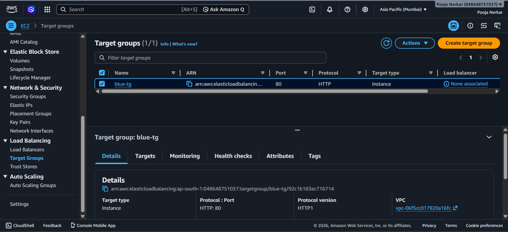

**Step 3 — Auto Scaling Group**

The Auto Scaling Group manages how many servers are running at any time. It uses the Launch Template to create new servers when needed and terminates servers when traffic drops. If a server crashes at 3am, ASG detects it and launches a replacement automatically without any human involvement.

Created `blue-asg` with:
- Subnets across ap-south-1a, ap-south-1b, ap-south-1c
- Desired: 2, Minimum: 1, Maximum: 4
- ELB health checks enabled

Screenshot: 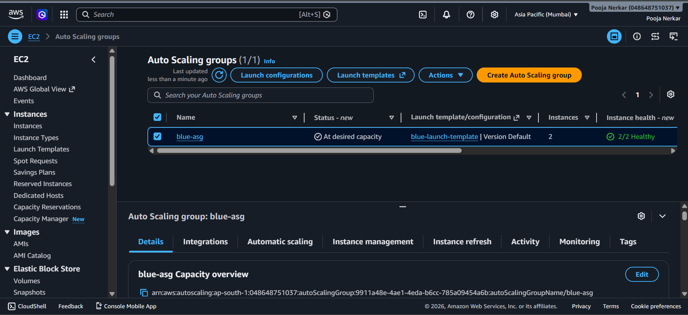
Screenshot: 
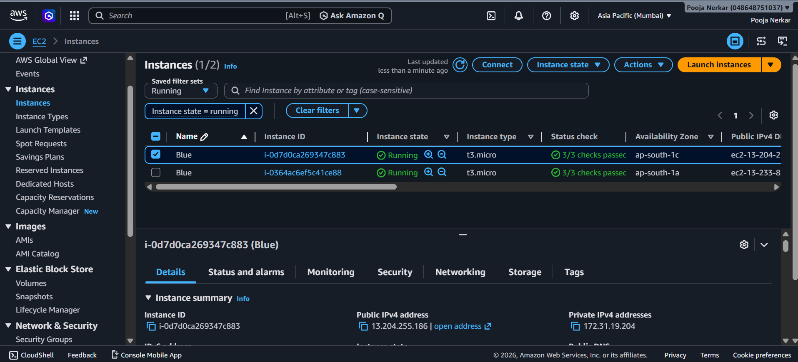

---

**Step 4 — Application Load Balancer**

The ALB is the single entry point for all user traffic. Users never communicate with EC2 instances directly. The ALB receives every request and forwards it to healthy servers in the target group.

Created `myapp-alb` as internet-facing, across all 3 availability zones, with HTTP:80 listener forwarding to `blue-tg`.

Screenshot: 
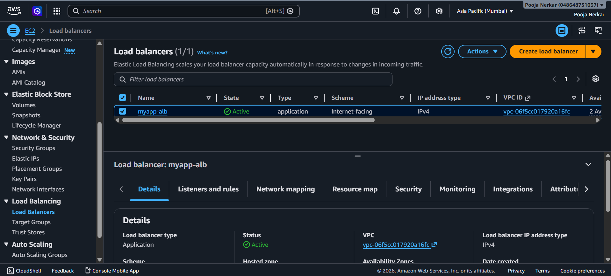

---

**Step 5 — Verified Blue is Live**

Opened the ALB DNS name in a browser and confirmed Version 1.0 is serving traffic. The page displays the EC2 Instance ID to confirm which server handled the request.

Screenshot: 


---

### Phase 2 — Green Environment (Version 2.0)

The Green environment is the new version. It is built and fully tested before any user traffic is sent to it.

**Step 6 — Green Launch Template**

Created `green-launch-template` with a new User Data script that deploys Version 2.0. New features in this version:
- About Page Added
- Dark Mode Support
- Performance Improved 40%

Screenshot: 
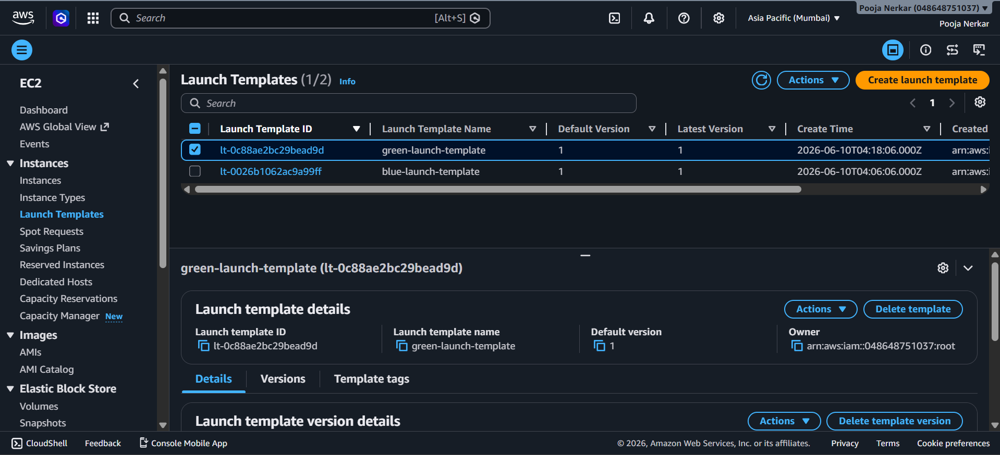

---

**Step 7 — Green Target Group**

Created `green-tg` with the same settings as `blue-tg`.

Screenshot: 
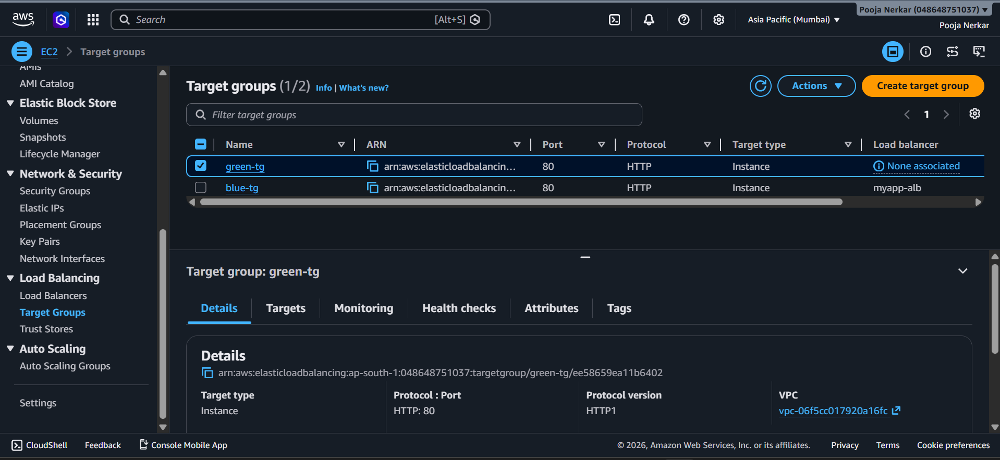

---

**Step 8 — Green Auto Scaling Group**

Created `green-asg` using `green-launch-template` attached to `green-tg`. At this point both `blue-asg` and `green-asg` are running simultaneously. Blue is handling all live traffic. Green is running but receiving zero traffic from the ALB.

Screenshot: 
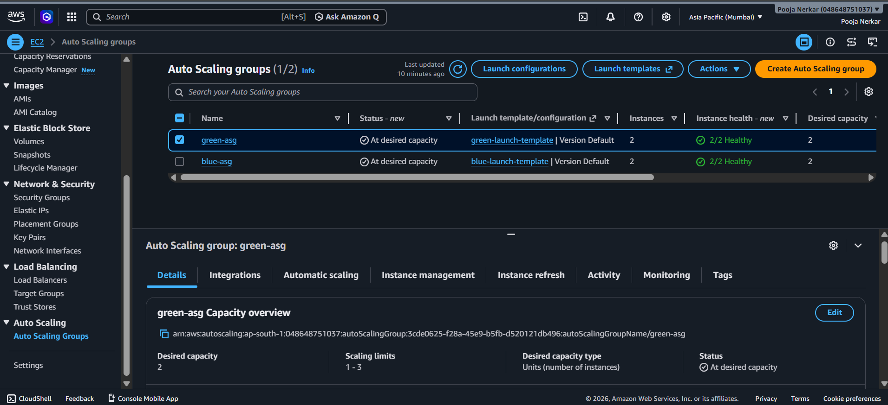

---

**Step 9 — Tested Green Directly Before Switching**

Before pointing any user traffic to Green, I accessed it directly using the EC2 instance's public IP address to verify Version 2.0 is working correctly. This is a critical step — never switch traffic to an untested environment.

Screenshot: 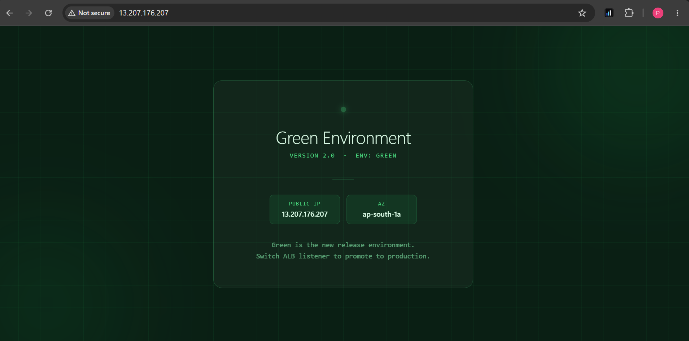

---

### Phase 3 — Zero Downtime Deployment

**Step 10 — Switch Traffic from Blue to Green**

Changed the ALB listener rule to forward 100% of traffic to `green-tg` instead of `blue-tg`. This single change takes 2 seconds. Users accessing the application during the switch experience at most one failed request.

ALB → Listeners → Edit HTTP:80 → Changed target group from `blue-tg` to `green-tg`.

Screenshot: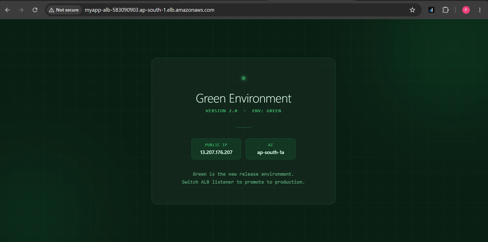

---

**Step 11 — Rollback Test**

Simulated a critical bug being reported in Version 2.0. Switched the ALB listener back to `blue-tg`. Version 1.0 was restored in under 10 seconds. The Blue environment was kept running specifically for this scenario.

Screenshot: 
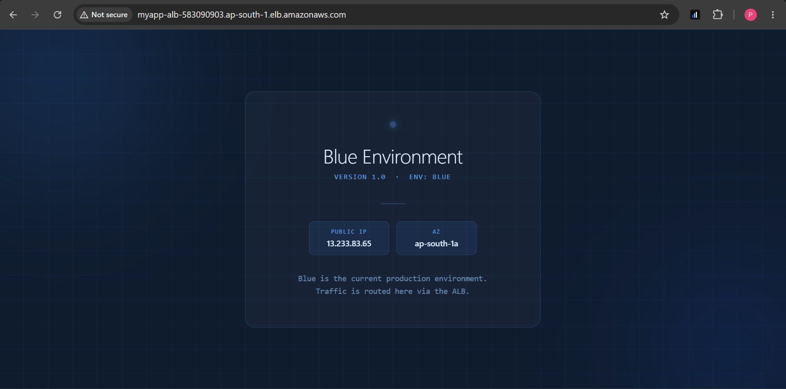

---

### Phase 4 — Canary Deployment

Instead of switching 100% of traffic at once, Canary deployment shifts traffic gradually. This limits the impact of any issue in the new version to only a small percentage of users.

**Step 12 — 80% Blue / 20% Green**

Sent 20% of traffic to Green first. Refreshed the ALB URL multiple times to confirm both environments were responding.

| Target Group | Weight | % of Traffic |
|---|---|---|
| blue-tg | 80 | 80% |
| green-tg | 20 | 20% |

Screenshot: 


---

**Step 13 — 50% Blue / 50% Green**

No errors found in the 20% test. Increased Green traffic to 50%.

| Target Group | Weight | % of Traffic |
|---|---|---|
| blue-tg | 50 | 50% |
| green-tg | 50 | 50% |

Screenshot: 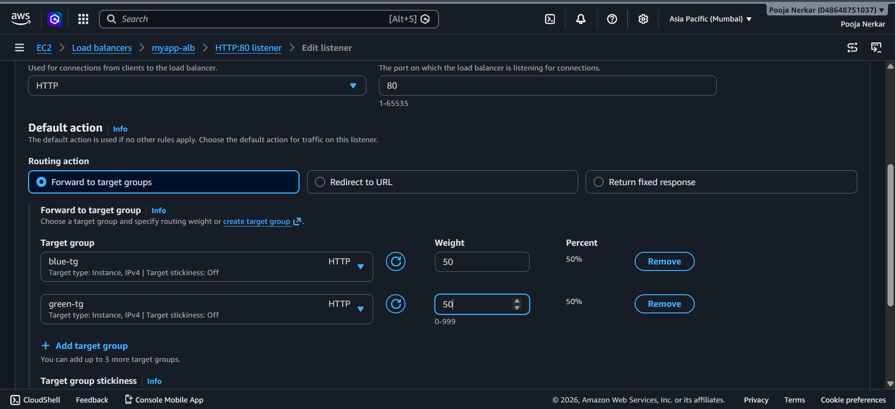

---

**Step 14 — 0% Blue / 100% Green**

Green confirmed stable. Completed the migration by sending all traffic to Green.

| Target Group | Weight | % of Traffic |
|---|---|---|
| blue-tg | 0 | 0% |
| green-tg | 100 | 100% |

Screenshot: 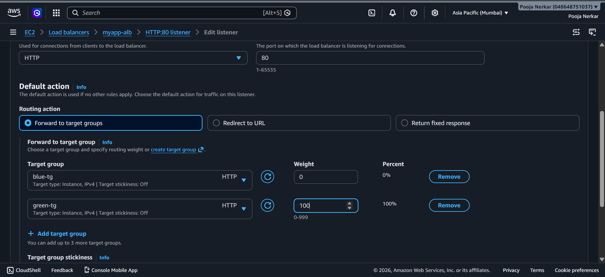
Screenshot: 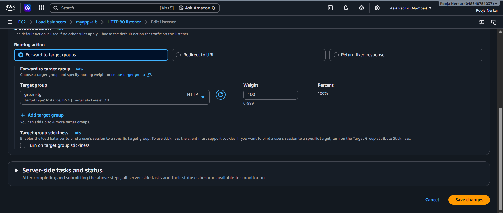

---

## Results Summary

| What was tested | Result |
|---|---|
| Deployment downtime | 0 seconds |
| Rollback time | Under 10 seconds |
| Canary steps completed | 80/20, 50/50, 0/100 |
| Availability Zones | 3 (ap-south-1a, 1b, 1c) |
| Total EC2 instances | 4 (2 Blue + 2 Green) |
| ASG self-healing | Verified — auto-replaced terminated instance |

---

## Key Concepts

**Blue-Green Deployment**
Two identical environments run simultaneously. Blue is live. Green gets the new version. Traffic switches at the load balancer level. Blue stays running for rollback.

**Canary Deployment**
A safer approach where traffic is shifted gradually — 10% to 20% to 50% to 100%. Limits the blast radius if the new version has issues.

**Auto Scaling Group Self-Healing**
If any EC2 instance fails, ASG detects it within minutes and automatically launches a replacement using the Launch Template. No manual action needed.

**Multi-AZ High Availability**
Servers distributed across three Availability Zones. If an entire AWS data center goes down, the application continues running from the remaining zones.

---

## Cost Note

The ALB is not covered by the AWS Free Tier and charges approximately $0.008 per hour. After completing this project, resources were deleted in the following order to stop all charges:

1. Delete both Auto Scaling Groups (this terminates all EC2 instances)
2. Delete the Application Load Balancer
3. Delete both Target Groups
4. Delete both Launch Templates

---

## What I Learned

Before this project I understood Blue-Green deployment as a concept. After building it hands-on I understand exactly how the ALB weighted routing controls traffic split, why keeping Blue running after the switch is important, how ASG and Launch Templates work together to make both environments identical, and why testing Green on a direct EC2 IP before switching ALB traffic is a non-negotiable step.

---

## Connect

- LinkedIn: https://www.linkedin.com/in/pooja-nerkar/
- Email: poojanerkarofficial@gmail.com
- Location: Pune, Maharashtra, India
